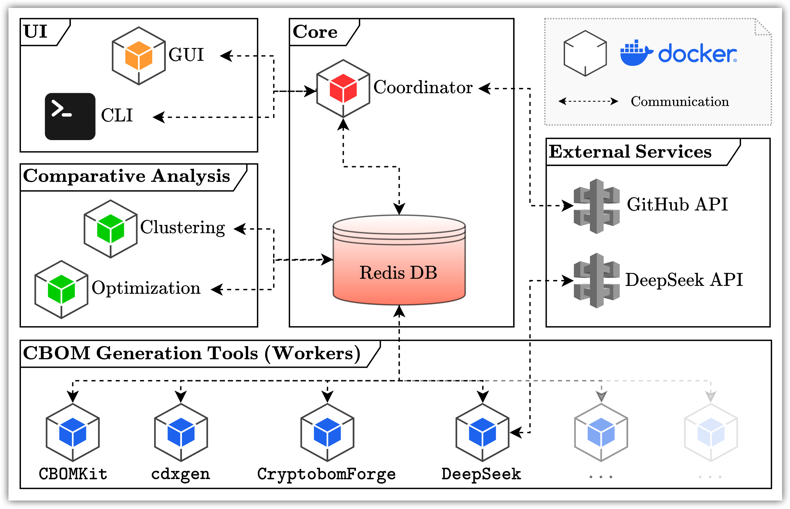

# **BF-CBOM**: Benchmarking Framework for CBOM Generator Tools

*Benchmarking Cryptography Bill of Material (CBOM) generators end-to-end: coordinating containerized jobs, normalizing outputs, and scoring results across ecosystems. In short, your **b**est **f**riend for generating and analyzing CBOMs.*

<div align="center">
  
  
</div>

</br>

<div align="center">
  <strong>
    👋 <a href="#introduction">Introduction</a> &nbsp;&nbsp;| &nbsp;&nbsp; 
    🚀 <a href="#setup">Setup</a> &nbsp;&nbsp;|&nbsp;&nbsp; 
    🛠️ <a href="#developer-notes">Developer Notes</a> 
  </strong>
</div>

</br>

<div align="center">
  <a href="https://doi.org/10.5281/zenodo.17140610"></a>
  <a href="https://github.com/SEG-UNIBE/BF-CBOM/releases"></a>
  </br>
  <a href="#"></a>
  <a href="#"></a>
  <a href="#"></a>
  <a href="./LICENSE"></a>
</div>

</br>
</br>


## Introduction

BF-CBOM is a research-grade harness for comparing heterogeneous CBOM generators side-by-side.
It orchestrates full container stacks, captures worker outputs, normalizes results, and surfaces scoring dashboards for reviewers.

### Key Features

- **Coordinator-first control plane:** a Streamlit UI backed by Redis schedules benchmarks, tracks job state, and surfaces results for reviewers.
- **Containerised worker plugins:** every CBOM generator runs in its own Docker image but speaks the same Redis-driven instruction protocol.
- **Scriptable CLI:** a Typer-based interface can launch benchmarks, export configs, or bundle CBOM artefacts for offline analysis.
- **Reproducible runs:** checked-in `.env` templates, Dockerfiles, and `uv`-managed Python dependencies keep environments consistent across machines.


### CBOM Generators Under Scrutiny

BF-CBOM currently integrates four different CBOM generation approaches to enable side-by-side comparisons.
Each generator brings a unique methodology for detecting and cataloging cryptographic assets:

- **[`CBOMKit`](https://github.com/PQCA/cbomkit)**:
IBM Research's dedicated CBOM generator for Python and Java, now maintained by the Post-Quantum Cryptography Alliance.
Uses SonarQube for static analysis and supports compliance policy checks.

- **[`cdxgen`](https://github.com/CycloneDX/cdxgen)**:
CycloneDX's official generator, primarily for SBOMs but with CBOM extensions since April 2024.
CBOM generation currently limited to Python and Java projects.

- **[`CryptobomForge`](https://github.com/Santandersecurityresearch/cryptobom-forge)**:
Santander Security Research's CLI tool that processes CodeQL SARIF outputs rather than source code directly, making it language-agnostic.

- **[`DeepSeek`](https://www.deepseek.com/)**:
Experimental LLM-based approach using DeepSeek's language model for zero-shot cryptographic asset detection via prompt-based code analysis.

## Setup

**🚩 1. Docker**

BF-CBOM is a multi-container environment (Redis, the coordinator UI, and one container per CBOM generation tool), so Docker must be installed locally.
Install **Docker Desktop** using the official guide for [macOS](https://docs.docker.com/desktop/setup/install/mac-install/) or [Windows](https://docs.docker.com/desktop/setup/install/windows-install/).

After installation, open a new terminal and run the following command to confirm that Docker and Docker Compose are available.
If everything is set up correctly, you will see two version strings.

```bash
docker --version && docker compose version
```

**🚩 2. This Repo**

Clone the repository and navigate into it:

```bash
git clone https://github.com/SEG-UNIBE/BF-CBOM.git
cd BF-CBOM
```

**🚩 3. Environment Variables**

Prepare the environment files under `docker/env/`. Each service ships with a `*.env.template` describing the secrets it requires. Duplicate every template, drop the `.template` suffix, and keep the resulting `.env` files local (they are git-ignored). After this step the directory should resemble:

```text
├── docker
│   └── env
│       ├── coordinator.env
│       ├── coordinator.env.template
│       ├── worker-cbomkit.env
│       ├── worker-cbomkit.env.template
│       └── ...  (and so on)
```

> [!NOTE]
> Run `make ensure-env` on macOS/Linux or `pwsh ./scripts/ensure_env.ps1` on Windows to create the `.env` files automatically.

At minimum set `GITHUB_TOKEN` inside `docker/env/coordinator.env`. In case you do not have one already, see [how to create a personal access token (classic)](https://docs.github.com/en/authentication/keeping-your-account-and-data-secure/managing-your-personal-access-tokens#creating-a-personal-access-token-classic).

From this point, you can continue with the setup using one of the two options described below.
Either way, the build takes about 5–15 minutes for the first time (depending on hardware and internet speed) and requires roughly 20 GB of disk space for the images.

### Option 1 – Disposable Builder Container

Use this when you want to keep tooling off your host.

**🚩 4. Build the Builder Container**

Build the helper image that bundles all required tooling:

```bash
docker build -f docker/Dockerfile.builder -t bf-cbom/builder .
```

**🚩 5. Run the Builder Container**

Run the builder container. It clones the repo inside the container, reuses your local `.env` templates, and brings the stack up:

```bash
docker run --rm -it \
  -v /var/run/docker.sock:/var/run/docker.sock \
  -v "$(pwd)/docker/env":/workspace/secrets/env:ro \
  --name bf-cbom-builder \
  bf-cbom/builder -lc "\
    git clone --branch main https://github.com/SEG-UNIBE/BF-CBOM.git repo && \
    cp -vf /workspace/secrets/env/*.env repo/docker/env/ && \
    cd repo && \
    make up-prod \
  "
```

Exit with `Ctrl+C` when you are done benchmarking.
The session is ephemeral; all tooling lives inside the container.

> [!NOTE]
> **Windows** users need backticks (`) for line continuations in PowerShell, so the snippet below keeps the disposable builder flow copy/paste-friendly:
> 
> ```powershell
> $pwdPath = (Get-Location).Path
> docker run --rm -it `
>   -v /var/run/docker.sock:/var/run/docker.sock `
>   -v "$pwdPath/docker/env:/workspace/secrets/env:ro" `
>   --name bf-cbom-builder `
>   bf-cbom/builder -lc "git clone --branch main https://github.com/SEG-UNIBE/BF-CBOM.git repo && cp -vf /workspace/secrets/env/*.env repo/docker/env/ && cd repo && make up-prod"
> ```

### Option 2 – Makefile

In this option, you will build and compose the docker compose environment directly using your host machine.

#### MacOS / Linux


**🚩 4. Build using Makefile**

The project uses [GNU Make](https://www.gnu.org/software/make/) to simplify container orchestration.
Most Linux distributions include `make` by default.
On macOS, it comes with the *Xcode command line tools*, which you can install by running `xcode-select --install` in a terminal if not already present.

From the repository's root folder, start the full stack of services with:

```bash
make up-prod
```

Note that it can take up to 20 minutes, depending on your hardware and internet speed.

Docker Compose will launch and manage all containers. Stop the stack anytime with `Ctrl+C`.

**🚩 5. Local CLI (optional)**

If `make up-prod` completed successfully and the containers are running, you can also interact with BF-CBOM through its command-line interface (CLI).
From the repository's root folder, run:

```bash
uv run misc/cli/cli.py
```

#### Windows

**🚩 4. Install Git Bash**

Install [Git for Windows](https://git-scm.com/downloads/win) and use Git Bash for all setup commands. It provides the Unix-compatible environment expected by the scripts.

**🚩 5. Install GNU Make**

Install GNU Make and verify `make --version` in Git Bash.

> [!NOTE]
> Package managers like [Chocolatey](https://chocolatey.org/) (`choco install make`) or [MSYS2](https://www.msys2.org/) (`pacman -S make`) simplify this step.


**🚩 6. Launch the Stack**

From the repository root (inside Git Bash), start the environment:

```bash
make up-prod
```

Stop anytime with `Ctrl+C`.

### Local CLI (optional)

If `make up-prod` completed successfully and the containers are running, you can also interact with BF-CBOM through its command-line interface (CLI) in addition to the GUI.
Because the CLI runs locally, a minimal Python setup is required before invoking it.

**🎏 1. Python and `uv`**

Install Python 3.12 and `uv`, the dependency manager used by BF-CBOM.

- For Python, download at least the version 3.12 from the [official site](https://www.python.org/downloads/).
- To install `uv`, follow the `curl` instructions on [uv's webpage](https://docs.astral.sh/uv/#installation).

> [!NOTE]
> Using a package manager is often easiest: `brew install python@3.12 uv` on macOS, or `sudo apt-get install python3.12 uv` on Linux.

**🎏 2. Launch CLI**

From the repository's root folder, run:

```bash
uv run misc/cli/cli.py
```

The command prints the CLI's commands and options in the terminal.

## Developer Notes

BF-CBOM follows a deliberately modular design as illustrated in the figure below
At its core, the `Coordinator` orchestrates all benchmarking activities through a message-driven architecture.
Redis serves dual roles as both a persistence layer for intermediate results and a queue system enabling asynchronous, scalable communication between components.
This design creates decoupled interactions that make the framework flexible for extension.



### Adding Additional Workers

1. Duplicate `workers/skeleton` to `workers/<mytool>` and implement `handle_instruction`.
2. Create `docker/env/<mytool>.env` for credentials and configuration specific to the worker.
3. Start from `docker/Dockerfile.worker-skeleton` (or craft a bespoke Dockerfile if required).
4. Register the worker service in `docker-compose.yml`, pointing at the new `env_file`.
5. Append the worker name to the `AVAILABLE_WORKERS` list in the `Makefile` so shared targets pick it up.

### Formatting and Linting

Ruff is configured in `pyproject.toml` for both formatting and linting:

- `uv run ruff format`
- `uv run ruff check --fix`
